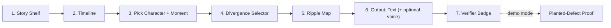

	# REQUIREMENTS — "Story Time Machine"
	### Product Requirements Doc — hand this to Claude Code as-is

> 	[!abstract] What this file is
> 	A build-ready spec, written the way a senior product designer would brief an engineering team. Covers: the product, every screen, every component, the data contract, the visual/motion/sound direction, what's in scope vs explicitly cut, and acceptance criteria. Downstream: [[DECISION — Problem Statement Analysis]] (why this product), [[09 - Proposed Architecture]] (the backend engine this UI sits on top of).

	---

	## 1. One-liner

> 	**"Go back to any moment in a story, change one decision — watch what breaks, what holds, and hear the story that follows. Guaranteed consistent."**

	Product codename: **CANON: Time Machine**. Consumer-facing skin over the Canon Kernel (story-state + verifier engine your backend team is building — see [[09 - Proposed Architecture]]).

	---

	## 2. Goals for this build (what "done" means)

> 	[!success] This build succeeds if a judge can, unprompted, do this in under 90 seconds
> 	1. Pick a story from the shelf
> 	2. Pick a character + a moment in the timeline
> 	3. Flip one decision
> 	4. **See** the ripple (what broke / what held) — *this is the moment that has to land*
> 	5. **Read** (and ideally hear) the resulting alternate scene
> 	6. Watch the system catch a deliberately-planted contradiction, live, with proof

	--!
	Everything below is designed backward from that 90 seconds.

	---

	## 3. Users (for this artifact, there are two)

	| User                                           | What they need                                                                          | Where they show up                                           |
	| ---------------------------------------------- | --------------------------------------------------------------------------------------- | ------------------------------------------------------------ |
	| **The Judge** (real audience)                  | Understand the concept in <10 sec, be visually impressed, believe the consistency claim | Every screen, but especially the Ripple Map + verifier badge |
	| **The Listener** (the persona inside the demo) | A satisfying, low-friction way to explore "what if," get a payoff quickly               | Story Shelf → Output flow                                    |

	Design for the judge watching over the demo-operator's shoulder, not for a first-time app user doing onboarding. **No tutorials, no empty states that need explaining — every screen should be self-evident within 2 seconds.**

	---

	## 4. Scope — MoSCoW (this is the part that prevents scope creep)

> 	[!danger] Read this before wireframing anything. Build MUST fully, in order. SHOULD only if MUST is solid and there's time left. COULD is pitch-deck-only — do not attempt to build it.

	### 🔴 MUST (the guaranteed demo — this is the whole product tonight)
	1. **Story Shelf** — pick from 1–3 pre-seeded original stories (build 1 deeply, stub 2 more as covers for shelf-realism)
	2. **Story Timeline** — episode-by-episode view of the chosen story, characters shown as portraits
	3. **Moment + Character Picker** — click a character at a specific episode; see the pre-authored decision point at that spot
	4. **Divergence Selector** — choose from 2–3 pre-written alternate decisions (NOT freeform text input — freeform is a quality/control risk under time pressure)
	5. **Ripple Map** — the visual dependency graph: invalidated facts (red) / held facts (green) / new-facts-needed (blue), with a live counter
	6. **Regenerated Scene (text)** — the alternate episode text, generated against the new state, rendered cleanly
	7. **Verifier Badge** — a clear "✓ Canon-consistent" (or a flagged contradiction with citation, in the planted-defect demo)
	8. **Planted-Defect Demo Mode** — a single button/toggle that deliberately runs a broken branch so the verifier catches it live, on stage, with the source citation shown
	9. **Presenter Mode** — a clean, full-screen, no-debug-UI view for the actual stage demo

	### 🟡 SHOULD (build only after every MUST item works end-to-end)
	10. Voice narration (TTS) of the regenerated scene, with emotion inflection
	11. 1–2 illustrative stills synced to the narration
	12. A second fully-fleshed story (proves it's not a one-off hack)
	13. Freeform "type your own what-if" input (as an *additional* option next to the presets, never replacing them)

	### ⚪ COULD (say it in the pitch, never build it tonight)
	14. Full catalog support (all Pocket FM shows)
	15. Full per-character epistemic knowledge UI (who-knows-what visualizer)
	16. Save/share a generated alt-timeline; community voting on best "what ifs"
	17. Creator-facing dashboard mode (the Plot Hole Hunter hedge — mention as "same engine, different surface")

	---

	## 5. Core user flow (linear, no branching menus)

	```mermaid
	graph LR
	    A["1. Story Shelf"] --> B["2. Timeline"]
	    B --> C["3. Pick Character + Moment"]
	    C --> D["4. Divergence Selector"]
	    D --> E["5. Ripple Map"]
	    E --> F["6. Output: Text (+ optional voice)"]
	    F --> G["7. Verifier Badge"]
	    G -.->|"demo mode"| H["Planted-Defect Proof"]
	```

	No dead ends, no back-and-forth navigation puzzles. One direction, always a "next" affordance visible. This is a **guided demo path**, not an open-world app.

	---

	## 6. Screen-by-screen spec (wireframe-level)

	### Screen 1 — Story Shelf

	```
	┌─────────────────────────────────────────────┐
	│   CANON            [presenter mode toggle]  │
	│                                               │
	│   ┌────────┐   ┌────────┐   ┌────────┐      │
	│   │ cover  │   │ cover  │   │ cover  │      │
	│   │ art 1  │   │ art 2  │   │ art 3  │      │
	│   │        │   │        │   │        │      │
	│   │ Title  │   │ Title  │   │ Title  │      │
# REQUIREMENTS — "Story Time Machine"
### Product Requirements Doc — hand this to Claude Code as-is

> [!abstract] What this file is
> A build-ready spec, written the way a senior product designer would brief an engineering team. Covers: the product, every screen, every component, the data contract, the visual/motion/sound direction, what's in scope vs explicitly cut, and acceptance criteria. Downstream: [[DECISION — Problem Statement Analysis]] (why this product), [[09 - Proposed Architecture]] (the backend engine this UI sits on top of).

---

## 1. One-liner

> **"Go back to any moment in a story, change one decision — watch what breaks, what holds, and hear the story that follows. Guaranteed consistent."**

Product codename: **CANON: Time Machine**. Consumer-facing skin over the Canon Kernel (story-state + verifier engine your backend team is building — see [[09 - Proposed Architecture]]).

---

## 2. Goals for this build (what "done" means)

> [!success] This build succeeds if a judge can, unprompted, do this in under 90 seconds
> 1. Pick a story from the shelf
> 2. Pick a character + a moment in the timeline
> 3. Flip one decision
> 4. **See** the ripple (what broke / what held) — *this is the moment that has to land*
> 5. **Read** (and ideally hear) the resulting alternate scene
> 6. Watch the system catch a deliberately-planted contradiction, live, with proof

--!
Everything below is designed backward from that 90 seconds.

---

## 3. Users (for this artifact, there are two)

| User                                           | What they need                                                                          | Where they show up                                           |
| ---------------------------------------------- | --------------------------------------------------------------------------------------- | ------------------------------------------------------------ |
| **The Judge** (real audience)                  | Understand the concept in <10 sec, be visually impressed, believe the consistency claim | Every screen, but especially the Ripple Map + verifier badge |
| **The Listener** (the persona inside the demo) | A satisfying, low-friction way to explore "what if," get a payoff quickly               | Story Shelf → Output flow                                    |

Design for the judge watching over the demo-operator's shoulder, not for a first-time app user doing onboarding. **No tutorials, no empty states that need explaining — every screen should be self-evident within 2 seconds.**

---

## 4. Scope — MoSCoW (this is the part that prevents scope creep)

> [!danger] Read this before wireframing anything. Build MUST fully, in order. SHOULD only if MUST is solid and there's time left. COULD is pitch-deck-only — do not attempt to build it.

### 🔴 MUST (the guaranteed demo — this is the whole product tonight)
1. **Story Shelf** — pick from 1–3 pre-seeded original stories (build 1 deeply, stub 2 more as covers for shelf-realism)
2. **Story Timeline** — episode-by-episode view of the chosen story, characters shown as portraits
3. **Moment + Character Picker** — click a character at a specific episode; see the pre-authored decision point at that spot
4. **Divergence Selector** — choose from 2–3 pre-written alternate decisions (NOT freeform text input — freeform is a quality/control risk under time pressure)
5. **Ripple Map** — the visual dependency graph: invalidated facts (red) / held facts (green) / new-facts-needed (blue), with a live counter
6. **Regenerated Scene (text)** — the alternate episode text, generated against the new state, rendered cleanly
7. **Verifier Badge** — a clear "✓ Canon-consistent" (or a flagged contradiction with citation, in the planted-defect demo)
8. **Planted-Defect Demo Mode** — a single button/toggle that deliberately runs a broken branch so the verifier catches it live, on stage, with the source citation shown
9. **Presenter Mode** — a clean, full-screen, no-debug-UI view for the actual stage demo

### 🟡 SHOULD (build only after every MUST item works end-to-end)
10. Voice narration (TTS) of the regenerated scene, with emotion inflection
11. 1–2 illustrative stills synced to the narration
12. A second fully-fleshed story (proves it's not a one-off hack)
13. Freeform "type your own what-if" input (as an *additional* option next to the presets, never replacing them)

### ⚪ COULD (say it in the pitch, never build it tonight)
14. Full catalog support (all Pocket FM shows)
15. Full per-character epistemic knowledge UI (who-knows-what visualizer)
16. Save/share a generated alt-timeline; community voting on best "what ifs"
17. Creator-facing dashboard mode (the Plot Hole Hunter hedge — mention as "same engine, different surface")

---

## 5. Core user flow (linear, no branching menus)



No dead ends, no back-and-forth navigation puzzles. One direction, always a "next" affordance visible. This is a **guided demo path**, not an open-world app.

---

## 6. Screen-by-screen spec (wireframe-level)

### Screen 1 — Story Shelf

```
┌─────────────────────────────────────────────┐
│   CANON            [presenter mode toggle]  │
│                                               │
│   ┌────────┐   ┌────────┐   ┌────────┐      │
│   │ cover  │   │ cover  │   │ cover  │      │
│   │ art 1  │   │ art 2  │   │ art 3  │      │
│   │        │   │        │   │        │      │
│   │ Title  │   │ Title  │   │ Title  │      │
│   │ 6 eps  │   │ 6 eps  │   │ 6 eps  │      │
│   └────────┘   └────────┘   └────────┘      │
│      ▲ hover: subtle glow + fact-graph       │
│        pulsing faintly behind the cover      │
└─────────────────────────────────────────────┘
```
- **Purpose:** establish "this works on real stories," pick one, feel the product's tone in 2 seconds.
- **Interaction:** click a cover → Screen 2.
- **State:** only 1 card needs to be fully functional; others can be visually complete but non-interactive (labelled subtly or simply not clicked during demo).

### Screen 2 — Story Timeline

```
┌─────────────────────────────────────────────┐
│  ← Shelf        STORY TITLE                  │
│                                               │
│  Ep1 ─── Ep2 ─── Ep3 ─── Ep4 ─── Ep5 ─── Ep6│
│   ●        ●       ●●      ●       ●       ● │
│         (dots = characters present)          │
│                                               │
│  [Char A] [Char B] [Char C] [Char D]         │
│   portraits, clickable                       │
└─────────────────────────────────────────────┘
```
- **Purpose:** show the story has real structure (episodes, cast), not a single blob of text.
- **Interaction:** click a character portrait → their episodes highlight on the timeline → click a highlighted episode → Screen 3.
- **Motion:** timeline nodes gently breathe/pulse (low-amplitude, ambient — signals "the system is alive/tracking state").

### Screen 3 — Moment + Divergence Selector

```
┌─────────────────────────────────────────────┐
│  Episode 3 — "The Betrayal"                  │
│                                               │
│  ┌─────────────────────────────────────┐    │
│  │  Original: "Kael reveals the plan    │    │
│  │  to the council."                    │    │
│  └─────────────────────────────────────┘    │
│                                               │
│  What if instead...                          │
│  ○ Kael stays silent                         │
│  ○ Kael lies to the council                  │
│  ○ Kael warns the enemy first                │
│                                               │
│              [ FLIP THIS MOMENT → ]          │
└─────────────────────────────────────────────┘
```
- **Purpose:** the actual "what if" input — kept as bounded presets for reliability.
- **Interaction:** select a radio option → button activates → click → Screen 4.
- **Sound cue:** a distinct low "commit" tone on selection; a sharper "crack" sound on FLIP.

### Screen 4 — Ripple Map ⭐ (the moment everything is riding on)

```
┌─────────────────────────────────────────────┐
│              RIPPLE MAP                      │
│                                               │
│         ●───●───●              ● = fact      │
│        ╱         ╲                           │
│   ●───●   FLIP    ●───●───●                  │
│        ╲         ╱                           │
│         ●───●───●                            │
│                                               │
│   🔴 23 facts invalidated                    │
│   🟢 118 facts still hold                    │
│   🔵 4 new facts required                    │
│                                               │
│              [ SEE WHAT HAPPENS → ]          │
└─────────────────────────────────────────────┘
```
- **Purpose:** THIS is the wow moment and the trust moment simultaneously — it's both visually arresting and the actual proof of "consistently." Spend the most design/animation time here of any screen.
- **Interaction:** graph animates in (cascade: red nodes darken/die one by one, green nodes stay lit, blue nodes fade in) over ~2–3 seconds, then settles; counters count up live during the animation, not instantly.
- **Sound:** each invalidation = a tiny falling tick; each new-fact-needed = a rising chime; ambient bed underneath throughout.
- **Fallback if backend is slow:** this screen can run on a pre-computed/cached ripple result for the rehearsed demo path, with the live path reserved for a second, riskier example if time allows.

### Screen 5 — Output (Text → optional Voice)

```
┌─────────────────────────────────────────────┐
│  Episode 3 (Revised) — "The Betrayal"        │
│                                               │
│  Kael said nothing. The council waited,      │
│  and in that silence, Mira understood        │
│  what he could not say aloud...              │
│  [ full generated scene text ]               │
│                                               │
│  ✅ Canon-consistent — verified against      │
│     117 unaffected facts                     │
│                                               │
│  [ ▶ Listen ]  (SHOULD-tier, if ready)       │
└─────────────────────────────────────────────┘
```
- **Purpose:** the payoff. Text must be **MUST**-tier and rock solid; voice + stills are **SHOULD**-tier bonus, shown only if reliable.
- **Verifier badge states:** green check (consistent) / amber flag with a one-line citation ("contradicts: Kael is dead, established ep. 2") — both states must be designed, since the flagged state is what you show in Planted-Defect Mode.

### Screen 6 — Planted-Defect Proof (demo-mode toggle, not a "real" user screen)

```
┌─────────────────────────────────────────────┐
│  ⚠ DEMONSTRATION: Broken Branch              │
│                                               │
│  "Kael, long dead, walked into the room..."  │
│                                               │
│  ❌ CONTRADICTION FLAGGED                     │
│  Draft says: Kael is alive                   │
│  Canon says: Kael died — Episode 2, §3       │
│  [ view both passages side-by-side ]         │
└─────────────────────────────────────────────┘
```
- **Purpose:** this is your falsifiable proof moment — a single button reachable from Presenter Mode that runs a known-broken branch so the verifier visibly catches it, live, with the citation. This is arguably as important as the Ripple Map for judge trust.

### Screen 0 — Presenter Mode (wraps everything)

- A single global toggle that hides any dev/debug chrome (console logs, loading spinners with technical text, URLs) and replaces loading states with the Ripple Map's ambient animation so **there is no dead air on stage**.

---

## 7. Component inventory (for Claude Code to scaffold)

| Component | Used in | Notes |
|---|---|---|
| `StoryCard` | Shelf | cover image, title, episode count, hover glow |
| `TimelineTrack` | Timeline | horizontal episode nodes, character-presence dots |
| `CharacterPortrait` | Timeline, Moment Selector | clickable, highlights their episodes on click |
| `MomentCard` | Divergence Selector | shows original line + radio-style alt choices |
| `RippleGraph` | Ripple Map | the core viz — animated node graph, counters |
| `VerifierBadge` | Output, Defect Proof | green check / amber flag + citation, two states |
| `SceneOutputPanel` | Output | formatted generated text, optional audio player |
| `PresenterModeToggle` | Global | strips debug chrome, forces clean fallback states |
| `DefectDemoTrigger` | Presenter Mode | one-click known-broken-branch demo |

---

## 8. Data contract (frontend ↔ backend — freeze this early, build frontend against a mock immediately)

> [!tip] Build the frontend against this mock JSON from hour 1. Don't wait for the real backend — swap the base URL later.

```
GET  /api/stories
     → [{ id, title, coverUrl, episodeCount }]

GET  /api/stories/{id}
     → { id, title, episodes: [{ id, title, characters: [charId] }],
         characters: [{ id, name, portraitUrl }] }

GET  /api/stories/{id}/moments?episodeId=&characterId=
     → [{ momentId, originalLine, alternatives: [{ altId, label }] }]

POST /api/divergence
     body: { storyId, momentId, altId }
     → { rippleId, invalidated: [{factId, summary}],
         held: [{factId, summary}], newNeeded: [{factId, summary}] }

POST /api/regenerate
     body: { rippleId }
     → { sceneText, verifier: { status: "ok"|"flagged",
         citation?: { draftClaim, canonFact, episodeRef } } }

POST /api/narrate           (SHOULD-tier)
     body: { sceneText }
     → { audioUrl, imageUrls: [url, url] }

POST /api/demo/defect        (planted-defect proof)
     → { sceneText, verifier: { status: "flagged", citation } }
```

---

## 9. Visual, motion & sound direction

**Palette:** dark base (near-black / deep maroon), one accent (Pocket-FM-adjacent red/pink), a cool blue reserved *only* for "new fact needed" states, green/red reserved *only* for verifier states — don't reuse those two colors decoratively elsewhere, they need to stay meaningful.

**Typography:** one clean serif or slab-serif for story text (signals "narrative," not "app"), one geometric sans for UI chrome/labels.

**Motion principle:** everything ambient is slow and low-amplitude (breathing timeline nodes, drifting particles) — reserve fast, sharp motion exclusively for the Ripple Map cascade and the FLIP action, so those moments feel distinct from the resting state.

**Sound principle:** a quiet ambient bed under the whole experience; three distinct one-shot cues only — select (soft), commit/flip (deep, decisive), invalidate-tick (small, per-node during Ripple Map). Don't add more than these three or it gets noisy on stage.

---

## 10. Non-functional requirements

- **Stage-safe:** must run fully offline / on cached data if venue wifi fails — no hard dependency on a live API call during the actual pitch moment. Pre-cache the rehearsed demo path's ripple + output response.
- **Fast recovery:** if any screen errors, Presenter Mode should have a manual "skip to next screen with cached data" affordance — never let a crash end the demo.
- **Display target:** projector/large-screen aspect ratio (16:9), test contrast under bright venue lighting, not just on a laptop screen.
- **No login/accounts, no persistence beyond the session** — out of scope entirely.

---

## 11. Explicit out-of-scope (say these in the pitch, do not build)

- Any real Pocket FM catalog data or real third-party IP (Marvel, Three Idiots, etc.) rendered on screen
- Freeform, unconstrained story generation from arbitrary user text
- Multi-story, catalog-scale ingestion
- User accounts, saving, sharing, or social features
- Full per-character epistemic (who-knows-what) visualizer — mention it exists in the engine, don't build its UI

---

## 12. Acceptance criteria (definition of done, per MUST feature)

| Feature | Done when |
|---|---|
| Story Shelf | 1 story fully clickable end-to-end; 2 more visually present |
| Timeline | Characters clickable, correctly highlight their episodes |
| Divergence Selector | 1 fully working moment with 2–3 alt choices, wired to backend/mock |
| Ripple Map | Animates from real (or mocked) counts, no placeholder "lorem" data visible |
| Output panel | Displays real generated text, verifier badge reflects real/mocked status |
| Defect Demo | One click reliably reproduces the flagged state with a real citation |
| Presenter Mode | Zero visible debug output, zero unhandled loading spinners, during a full dry run |

---

## 13. Handoff notes for Claude Code

- **Suggested stack:** React + Vite + Tailwind for speed of scaffolding; Framer Motion for the Ripple Map and transition animations; a small D3 or custom SVG layer for the graph itself (Framer Motion alone won't do force-directed layout). Backend is Python-based per [[11 - Hackathon MVP vs Production]] (FastAPI is the natural pairing) — frontend should hit a local REST API on `localhost`, not assume same-process access.
- **Build order:** scaffold all screens against the mock JSON in §8 FIRST, before the real backend is ready. Wire to the real API only after both sides confirm the contract hasn't drifted.
- **Fastest path to a demoable skeleton:** Screens 1→2→3→4 (static/mock) can be built and look impressive with zero backend. Screen 5 needs the first real generation call. Prioritize accordingly if time is short.
- **Reuse:** the design tokens (§9) should be a single theme file/config, not scattered inline styles — needed since Presenter Mode and both story "skins" (this + the roadmap-slide Infinite Universe idea) should be able to share the same visual language later.

---

## 14. Open questions / assumptions to confirm with the team tonight

- [ ] Which story gets fully built (need the actual 4–6 episode text + one strong emotional divergence point authored tonight — this blocks everything downstream)
- [ ] Is voice narration (§4 SHOULD #10) realistically reachable given the audio pipeline's current readiness — confirm with backend before committing screen 5's voice button to the live demo
- [ ] Confirm the mock contract in §8 with whoever owns the Canon Kernel backend before frontend build starts, so there's no late-night reshape

---

## 🔗 Related
[[DECISION — Problem Statement Analysis]] · [[SUMMARY IN HINGLISH]] · [[09 - Proposed Architecture]] · [[11 - Hackathon MVP vs Production]] · [[CANON]]

---
*Written 2026-07-25. This is the build contract — treat changes to scope as changes to this file, not as side conversations.*

	│   │ 6 eps  │   │ 6 eps  │   │ 6 eps  │      │
	│   └────────┘   └────────┘   └────────┘      │
	│      ▲ hover: subtle glow + fact-graph       │
	│        pulsing faintly behind the cover      │
	└─────────────────────────────────────────────┘
	```
	- **Purpose:** establish "this works on real stories," pick one, feel the product's tone in 2 seconds.
	- **Interaction:** click a cover → Screen 2.
	- **State:** only 1 card needs to be fully functional; others can be visually complete but non-interactive (labelled subtly or simply not clicked during demo).

	### Screen 2 — Story Timeline

	```
	┌─────────────────────────────────────────────┐
	│  ← Shelf        STORY TITLE                  │
	│                                               │
	│  Ep1 ─── Ep2 ─── Ep3 ─── Ep4 ─── Ep5 ─── Ep6│
	│   ●        ●       ●●      ●       ●       ● │
	│         (dots = characters present)          │
	│                                               │
	│  [Char A] [Char B] [Char C] [Char D]         │
	│   portraits, clickable                       │
	└─────────────────────────────────────────────┘
	```
	- **Purpose:** show the story has real structure (episodes, cast), not a single blob of text.
	- **Interaction:** click a character portrait → their episodes highlight on the timeline → click a highlighted episode → Screen 3.
	- **Motion:** timeline nodes gently breathe/pulse (low-amplitude, ambient — signals "the system is alive/tracking state").

	### Screen 3 — Moment + Divergence Selector

	```
	┌─────────────────────────────────────────────┐
	│  Episode 3 — "The Betrayal"                  │
	│                                               │
	│  ┌─────────────────────────────────────┐    │
	│  │  Original: "Kael reveals the plan    │    │
	│  │  to the council."                    │    │
	│  └─────────────────────────────────────┘    │
	│                                               │
	│  What if instead...                          │
	│  ○ Kael stays silent                         │
	│  ○ Kael lies to the council                  │
	│  ○ Kael warns the enemy first                │
	│                                               │
	│              [ FLIP THIS MOMENT → ]          │
	└─────────────────────────────────────────────┘
	```
	- **Purpose:** the actual "what if" input — kept as bounded presets for reliability.
	- **Interaction:** select a radio option → button activates → click → Screen 4.
	- **Sound cue:** a distinct low "commit" tone on selection; a sharper "crack" sound on FLIP.

	### Screen 4 — Ripple Map ⭐ (the moment everything is riding on)

	```
	┌─────────────────────────────────────────────┐
	│              RIPPLE MAP                      │
	│                                               │
	│         ●───●───●              ● = fact      │
	│        ╱         ╲                           │
	│   ●───●   FLIP    ●───●───●                  │
	│        ╲         ╱                           │
	│         ●───●───●                            │
	│                                               │
	│   🔴 23 facts invalidated                    │
	│   🟢 118 facts still hold                    │
	│   🔵 4 new facts required                    │
	│                                               │
	│              [ SEE WHAT HAPPENS → ]          │
	└─────────────────────────────────────────────┘
	```
	- **Purpose:** THIS is the wow moment and the trust moment simultaneously — it's both visually arresting and the actual proof of "consistently." Spend the most design/animation time here of any screen.
	- **Interaction:** graph animates in (cascade: red nodes darken/die one by one, green nodes stay lit, blue nodes fade in) over ~2–3 seconds, then settles; counters count up live during the animation, not instantly.
	- **Sound:** each invalidation = a tiny falling tick; each new-fact-needed = a rising chime; ambient bed underneath throughout.
	- **Fallback if backend is slow:** this screen can run on a pre-computed/cached ripple result for the rehearsed demo path, with the live path reserved for a second, riskier example if time allows.

	### Screen 5 — Output (Text → optional Voice)

	```
	┌─────────────────────────────────────────────┐
	│  Episode 3 (Revised) — "The Betrayal"        │
	│                                               │
	│  Kael said nothing. The council waited,      │
	│  and in that silence, Mira understood        │
	│  what he could not say aloud...              │
	│  [ full generated scene text ]               │
	│                                               │
	│  ✅ Canon-consistent — verified against      │
	│     117 unaffected facts                     │
	│                                               │
	│  [ ▶ Listen ]  (SHOULD-tier, if ready)       │
	└─────────────────────────────────────────────┘
	```
	- **Purpose:** the payoff. Text must be **MUST**-tier and rock solid; voice + stills are **SHOULD**-tier bonus, shown only if reliable.
	- **Verifier badge states:** green check (consistent) / amber flag with a one-line citation ("contradicts: Kael is dead, established ep. 2") — both states must be designed, since the flagged state is what you show in Planted-Defect Mode.

	### Screen 6 — Planted-Defect Proof (demo-mode toggle, not a "real" user screen)

	```
	┌─────────────────────────────────────────────┐
	│  ⚠ DEMONSTRATION: Broken Branch              │
	│                                               │
	│  "Kael, long dead, walked into the room..."  │
	│                                               │
	│  ❌ CONTRADICTION FLAGGED                     │
	│  Draft says: Kael is alive                   │
	│  Canon says: Kael died — Episode 2, §3       │
	│  [ view both passages side-by-side ]         │
	└─────────────────────────────────────────────┘
	```
	- **Purpose:** this is your falsifiable proof moment — a single button reachable from Presenter Mode that runs a known-broken branch so the verifier visibly catches it, live, with the citation. This is arguably as important as the Ripple Map for judge trust.

	### Screen 0 — Presenter Mode (wraps everything)

	- A single global toggle that hides any dev/debug chrome (console logs, loading spinners with technical text, URLs) and replaces loading states with the Ripple Map's ambient animation so **there is no dead air on stage**.

	---

	## 7. Component inventory (for Claude Code to scaffold)

	| Component | Used in | Notes |
	|---|---|---|
	| `StoryCard` | Shelf | cover image, title, episode count, hover glow |
	| `TimelineTrack` | Timeline | horizontal episode nodes, character-presence dots |
	| `CharacterPortrait` | Timeline, Moment Selector | clickable, highlights their episodes on click |
	| `MomentCard` | Divergence Selector | shows original line + radio-style alt choices |
	| `RippleGraph` | Ripple Map | the core viz — animated node graph, counters |
	| `VerifierBadge` | Output, Defect Proof | green check / amber flag + citation, two states |
	| `SceneOutputPanel` | Output | formatted generated text, optional audio player |
	| `PresenterModeToggle` | Global | strips debug chrome, forces clean fallback states |
	| `DefectDemoTrigger` | Presenter Mode | one-click known-broken-branch demo |

	---

	## 8. Data contract (frontend ↔ backend — freeze this early, build frontend against a mock immediately)

> 	[!tip] Build the frontend against this mock JSON from hour 1. Don't wait for the real backend — swap the base URL later.

	```
	GET  /api/stories
	     → [{ id, title, coverUrl, episodeCount }]

	GET  /api/stories/{id}
	     → { id, title, episodes: [{ id, title, characters: [charId] }],
	         characters: [{ id, name, portraitUrl }] }

	GET  /api/stories/{id}/moments?episodeId=&characterId=
	     → [{ momentId, originalLine, alternatives: [{ altId, label }] }]

	POST /api/divergence
	     body: { storyId, momentId, altId }
	     → { rippleId, invalidated: [{factId, summary}],
	         held: [{factId, summary}], newNeeded: [{factId, summary}] }

	POST /api/regenerate
	     body: { rippleId }
	     → { sceneText, verifier: { status: "ok"|"flagged",
	         citation?: { draftClaim, canonFact, episodeRef } } }

	POST /api/narrate           (SHOULD-tier)
	     body: { sceneText }
	     → { audioUrl, imageUrls: [url, url] }

	POST /api/demo/defect        (planted-defect proof)
	     → { sceneText, verifier: { status: "flagged", citation } }
	```

	---

	## 9. Visual, motion & sound direction

	**Palette:** dark base (near-black / deep maroon), one accent (Pocket-FM-adjacent red/pink), a cool blue reserved *only* for "new fact needed" states, green/red reserved *only* for verifier states — don't reuse those two colors decoratively elsewhere, they need to stay meaningful.

	**Typography:** one clean serif or slab-serif for story text (signals "narrative," not "app"), one geometric sans for UI chrome/labels.

	**Motion principle:** everything ambient is slow and low-amplitude (breathing timeline nodes, drifting particles) — reserve fast, sharp motion exclusively for the Ripple Map cascade and the FLIP action, so those moments feel distinct from the resting state.

	**Sound principle:** a quiet ambient bed under the whole experience; three distinct one-shot cues only — select (soft), commit/flip (deep, decisive), invalidate-tick (small, per-node during Ripple Map). Don't add more than these three or it gets noisy on stage.

	---

	## 10. Non-functional requirements

	- **Stage-safe:** must run fully offline / on cached data if venue wifi fails — no hard dependency on a live API call during the actual pitch moment. Pre-cache the rehearsed demo path's ripple + output response.
	- **Fast recovery:** if any screen errors, Presenter Mode should have a manual "skip to next screen with cached data" affordance — never let a crash end the demo.
	- **Display target:** projector/large-screen aspect ratio (16:9), test contrast under bright venue lighting, not just on a laptop screen.
	- **No login/accounts, no persistence beyond the session** — out of scope entirely.

	---

	## 11. Explicit out-of-scope (say these in the pitch, do not build)

	- Any real Pocket FM catalog data or real third-party IP (Marvel, Three Idiots, etc.) rendered on screen
	- Freeform, unconstrained story generation from arbitrary user text
	- Multi-story, catalog-scale ingestion
	- User accounts, saving, sharing, or social features
	- Full per-character epistemic (who-knows-what) visualizer — mention it exists in the engine, don't build its UI

	---

	## 12. Acceptance criteria (definition of done, per MUST feature)

	| Feature | Done when |
	|---|---|
	| Story Shelf | 1 story fully clickable end-to-end; 2 more visually present |
	| Timeline | Characters clickable, correctly highlight their episodes |
	| Divergence Selector | 1 fully working moment with 2–3 alt choices, wired to backend/mock |
	| Ripple Map | Animates from real (or mocked) counts, no placeholder "lorem" data visible |
	| Output panel | Displays real generated text, verifier badge reflects real/mocked status |
	| Defect Demo | One click reliably reproduces the flagged state with a real citation |
	| Presenter Mode | Zero visible debug output, zero unhandled loading spinners, during a full dry run |

	---

	## 13. Handoff notes for Claude Code

	- **Suggested stack:** React + Vite + Tailwind for speed of scaffolding; Framer Motion for the Ripple Map and transition animations; a small D3 or custom SVG layer for the graph itself (Framer Motion alone won't do force-directed layout). Backend is Python-based per [[11 - Hackathon MVP vs Production]] (FastAPI is the natural pairing) — frontend should hit a local REST API on `localhost`, not assume same-process access.
	- **Build order:** scaffold all screens against the mock JSON in §8 FIRST, before the real backend is ready. Wire to the real API only after both sides confirm the contract hasn't drifted.
	- **Fastest path to a demoable skeleton:** Screens 1→2→3→4 (static/mock) can be built and look impressive with zero backend. Screen 5 needs the first real generation call. Prioritize accordingly if time is short.
	- **Reuse:** the design tokens (§9) should be a single theme file/config, not scattered inline styles — needed since Presenter Mode and both story "skins" (this + the roadmap-slide Infinite Universe idea) should be able to share the same visual language later.

	---

	## 14. Open questions / assumptions to confirm with the team tonight

	- [ ] Which story gets fully built (need the actual 4–6 episode text + one strong emotional divergence point authored tonight — this blocks everything downstream)
	- [ ] Is voice narration (§4 SHOULD #10) realistically reachable given the audio pipeline's current readiness — confirm with backend before committing screen 5's voice button to the live demo
	- [ ] Confirm the mock contract in §8 with whoever owns the Canon Kernel backend before frontend build starts, so there's no late-night reshape

	---

	## 🔗 Related
	[[DECISION — Problem Statement Analysis]] · [[SUMMARY IN HINGLISH]] · [[09 - Proposed Architecture]] · [[11 - Hackathon MVP vs Production]] · [[CANON]]

	---
	*Written 2026-07-25. This is the build contract — treat changes to scope as changes to this file, not as side conversations.*
